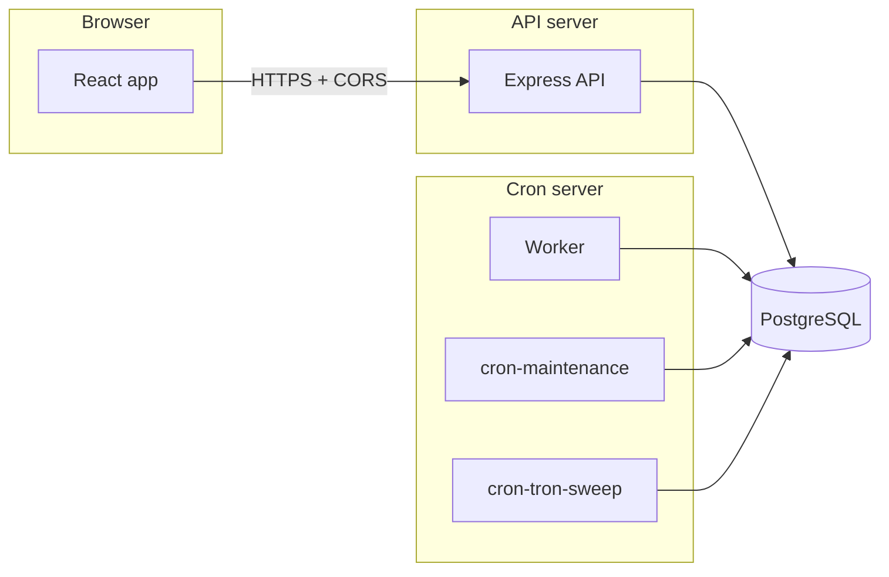

# Split services: React, API, Cron

The repo is already **three Node-oriented packages** (`client/`, `server/`, `cron/`). They stay loosely coupled: **no HTTP calls are required from cron to the API** for the deposit scanner — cron and API both talk to the **same PostgreSQL** and the same Prisma schema. That makes it straightforward to run each part on its **own machine** later.

## How they link



| Link | What to configure |
|------|-------------------|
| React → API | Build-time `VITE_API_ORIGIN` = public base URL of the API (e.g. `https://api.example.com`). |
| API → browser | `CLIENT_ORIGINS` must include every origin that serves the React app (e.g. `https://app.example.com`). |
| Emails / deep links | `APP_PUBLIC_URL` = where users open the portal (often same as React public URL). |
| API + Cron → data | **Same `DATABASE_URL`** (and run Prisma migrations from the **API** deploy path). |

Cron processes do **not** need the API’s `PORT` or JWT for scanning; they still need **RPC / chain env** and secrets (e.g. `MNEMONIC`, `RPC_*`) consistent with what the API uses, usually via the same `.env` keys you use today.

## Same machine (current default)

From the monorepo root:

```bash
npm ci
npm run prisma:deploy
npm run build
npm run pm2:resync   # or pm2 start ecosystem.config.cjs
```

## Future: separate hosts

### 1) React (static or Vite dev)

- **Build:** from repo root, set `VITE_API_ORIGIN` to the **public** API URL, then `npm run build -w client`. Deploy `client/dist` behind any static host or CDN.
- **Dev:** `npm run dev:client` — ensure root `.env` (or env) has `VITE_API_ORIGIN` pointing at your API if it is not on `localhost:${PORT}`.

### 2) API server

- Deploy `server/` (with Prisma schema/migrations from `server/prisma`).
- Env: at least `DATABASE_URL`, `JWT_SECRET`, `MNEMONIC`, `PORT`, `CLIENT_ORIGINS`, `APP_PUBLIC_URL`, required `RPC_*`, etc. (see root `.env.example`).
- Run migrations on deploy: `npm run prisma:deploy` (from root with workspaces, or `dotenv` + `prisma migrate deploy` in `server/` per your pipeline).

### 3) Cron server (worker + scheduled jobs)

- Today `cron` depends on **`crypto-payment-gateway` via `file:../server`** in `cron/package.json`. On a **dedicated cron VM** you can still clone the **full monorepo** and run only PM2 entries for worker/cron, **or** later replace that dependency with a **private npm package** or `git+ssh` URL pointing at the server package.
- Env: same DB and chain-related variables as production API (copy the relevant keys). `cron/src/bootstrap-runtime.js` loads repo-root `.env` if present, then `cron/.env` (later values override earlier ones).
- Processes: `entry-worker-erc20.js` + `entry-worker-trc20.js` (deposit scanners; or combined `entry-worker.js`), `entry-cron-1.js` (maintenance), `entry-cron-2.js` (tron sweep), or matching `npm run start:* -w cron` scripts.

## Adding another cron group (PM2)

See comments in `ecosystem.config.cjs`: add `jobs/group3.js`, `run-cron-3.js`, `entry-cron-3.js`, uncomment the PM2 app with a **descriptive** `name`, and add that name to `pm2:stop` / `deploy.sh` delete lists (optional for `pm2:resync` which uses `delete all`).

## Checklist before going multi-host

- [ ] `VITE_API_ORIGIN` matches the URL browsers use to reach the API (scheme + host + port, no trailing slash).
- [ ] `CLIENT_ORIGINS` on the API includes the React site origin(s).
- [ ] `APP_PUBLIC_URL` matches the user-facing portal URL.
- [ ] All cron/API hosts use the **same** `DATABASE_URL` (or replicas only if you know the replication lag story).
- [ ] After schema changes, run migrations **before** rolling out API/cron that expect new columns.
